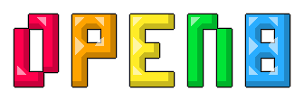
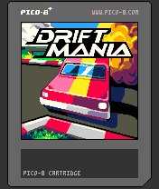
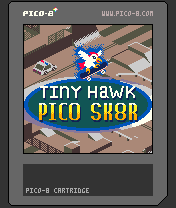
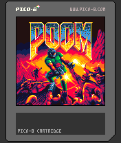
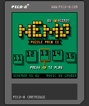

# Pico-8 for the N-Gage

This project is not directly affiliated with Pico-8 by Lexaloffle.  Instead, it is an effort
to develop a Pico-8 emulator specifically for the Nokia N-Gage, built from the ground up with
a strong emphasis on playability on the device.

This project is built on [Simple DirectMedia Layer 3](https://www.libsdl.org/).

   

The emulator is not yet in a playable state.
