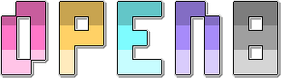

# open8

## About the Project

open8 is a PICO-8 emulator written in **C99** and currently under active development.
Built with portability as a primary goal, it is designed to run on a wide variety
of platforms, including devices such as the Nokia N-Gage. In principle, any system
supported by **SDL3** ([**Simple DirectMedia Layer 3**](https://www.libsdl.org/))
should be able to run open8.

## Why Another PICO-8 Emulator?

There are already several excellent PICO-8 emulators available, including
[fake-08](https://github.com/jtothebell/fake-08),
[pemsa](https://github.com/egordorichev/pemsa) and
[retro8](https://github.com/Jakz/retro8). Each of these projects serves its
own purpose and has contributed significantly to the community.

However, most existing emulators are written in modern C++, which can present
challenges when targeting older hardware and operating systems. These platforms
often have limited compiler support and may struggle with newer language features.

open8 takes a different approach by using **C99**, prioritizing portability and
compatibility across a broad range of systems. This focus makes it particularly
well-suited for the retro homebrew community, where support for legacy hardware
is often a key requirement. By keeping the codebase in C, open8 aims to remain
accessible, lightweight, and easy to port to unconventional or
resource-constrained platforms.

## Licence and Credits

- This project is licensed under the "The MIT License".  See the file
  [LICENSE.md](LICENSE.md) for details.

- Pico-8 is a fantasy console by Lexaloffle.  It is not affiliated with this project.
  For more information, visit the [Pico-8 website](https://www.lexaloffle.com/pico-8.php).

- Dirent by Toni Ronkko .  It is licensed under the
  "[The MIT License](https://github.com/tronkko/dirent/blob/master/LICENSE)".

- stb by Sean Barrett is licensed under "The MIT License".  See the file
  [LICENSE](https://github.com/nothings/stb/blob/master/LICENSE) for
  details.

- z8lua by Sam Hocevar is used for the Lua interpreter.  It is licensed under the
  "[The WTFPL License](http://www.wtfpl.net)".
