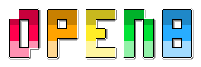

# open8

## About the project

open8 is a PICO-8 emulator written in C99, currently under active development.
Designed for portability, it aims to run on a wide range of platforms, including
the Nokia N-Gage. Any system supported by
[Simple DirectMedia Layer 3](https://www.libsdl.org/) should be capable of
running open8.

## Why?

Arn't there already a lot of other PICO-8 emulators such as
[fake-08](https://github.com/jtothebell/fake-08),
[pemsa](https://github.com/egordorichev/pemsa) and
[retro8](https://github.com/Jakz/retro8)? Why do we need another one?

All the projects mentioned here are written in relatively modern C++.  That's fine and
all of these projects have their raison d'être, but this poses problems for older platforms.

The main focus of open8 is on portability, especially with regard to the retro
homebrew scene.  Keeping the project source code in C helps to maintain portability.

## Screenshots

 

## Licence and Credits

- This project is licensed under the "The MIT License".  See the file
  [LICENSE.md](LICENSE.md) for details.

- Pico-8 is a fantasy console by Lexaloffle.  It is not affiliated with this project.
  For more information, visit the [Pico-8 website](https://www.lexaloffle.com/pico-8.php).

- Dirent by Toni Ronkko .  It is licensed under the
  "[The MIT License](https://github.com/tronkko/dirent/blob/master/LICENSE)".

- stb by Sean Barrett is licensed under "The MIT License".  See the file
  [LICENSE](https://github.com/nothings/stb/blob/master/LICENSE) for
  details.

- z8lua by Sam Hocevar is used for the Lua interpreter.  It is licensed under the
  "[The WTFPL License](http://www.wtfpl.net)".
